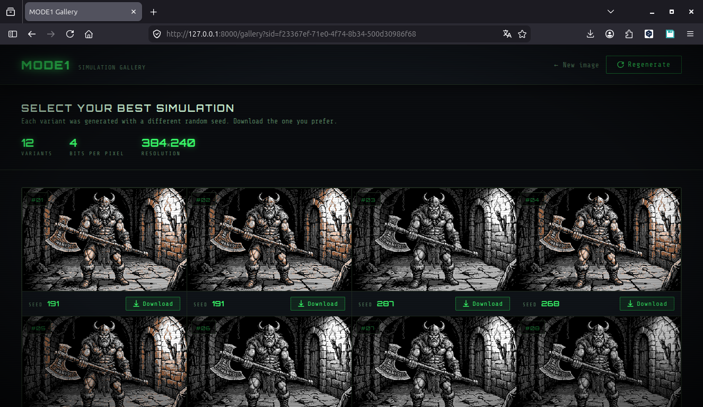

# X65 MODE1 Bitmap Converter



> **A collaborative AI experiment** — built with KIMI, Deepseek and Claude.
> Converts modern images into the native graphics format of the [**X65 retro computer**](https://x65.zone/).

---

A command-line tool that converts any image into data for the **MODE1 (Paletted Bitmap)** of the X65's **CGIA** graphics chip.
It generates the raw bitmap, a JSON file with the optimal 8-color palette for your image, and a visual simulation PNG so you can preview the result before uploading it to real hardware.

---

## Table of Contents

- [Features](#features)
- [Requirements](#requirements)
- [Installation](#installation)
- [Quick Start](#quick-start)
- [Web Gallery Interface](#web-gallery-interface)
- [Output Files](#output-files)
- [Command-Line Options](#command-line-options)
- [Using the Generated Files on X65](#using-the-generated-files-on-x65)
  - [1. Prepare Memory](#1-prepare-memory)
  - [2. Configure CGIA Plane Registers](#2-configure-cgia-plane-registers)
  - [3. Build a Display List](#3-build-a-display-list)
  - [4. Enable the Plane](#4-enable-the-plane)
- [Pixel Packing Details](#pixel-packing-details)
  - [1 bpp](#1-bpp)
  - [2 bpp](#2-bpp)
  - [3 bpp](#3-bpp)
  - [4 bpp (half-bright)](#4-bpp-half-bright)
  - [Multicolor Mode](#multicolor-mode)
- [Half-Bright Behaviour](#half-bright-behaviour)
- [Double-Width Option](#double-width-option)
- [Global Palette Note](#global-palette-note)
- [Tips for Better Color Reproduction](#tips-for-better-color-reproduction)
- [Troubleshooting](#troubleshooting)
- [License](#license)

---

## Features

- **Input**: any PNG or JPEG image (resized automatically to 384×240).
- **Modes**:
  - **1 bpp** – 2 colors (foreground / background).
  - **2 bpp** – 4 colors.
  - **3 bpp** – 8 colors.
  - **4 bpp** – 8 base colors + half-bright (16 distinct shades).
  - **Multicolor** – C64-style multicolor bitmap (2 bpp, fixed color mapping).
- **Optional double-width** – mimics the CGIA's `DOUBLE_WIDTH` flag.
- **Automatic palette optimization** using k-means clustering and nearest-neighbour mapping into the X65 global 256-color palette.
- **Reproducible results** with `--seed` – same image + same seed = identical binary output.
- **Web gallery** for comparing 12 random seeds side-by-side – quickly pick the best color composition.
- **Output**:
  - `mode1_bitmap.bin` – packed pixel data ready to be loaded into VRAM.
  - `mode1_shared_colors.json` – 8 palette indices (0–255) for the `shared_color0…7` registers.
  - `mode1_simulation.png` – exact visual preview of how the image will look on real hardware.

---

## Requirements

- Python **3.10** or later
- `numpy`
- `Pillow` (PIL fork)

Install the dependencies with:

```bash
pip install numpy pillow
```

---

## Installation

Just download `mode1_converter.py` and `web_app_*_ui.py` and place them in any directory.
You also need a **global palette file** (see [Global Palette Note](#global-palette-note)).
The converter auto-detects common file names:

- `x65_palette.json`
- `X65-palette_32x8_rgb.json`
- `X65_RGB_palette.png`

If none of them exist, supply your own with `--palette`.

---

## Quick Start

```bash
# 4 bpp (8 colors + half-bright) – usually the best quality/size trade-off
python mode1_converter.py photo.png --bpp 4

# 2 bpp (4 colors), aggressively small bitmap
python mode1_converter.py photo.png --bpp 2

# C64-style multicolor
python mode1_converter.py photo.png --multicolor

# 1 bpp with double-width pixels (retro "fat pixel" look)
python mode1_converter.py photo.png --bpp 1 --double-width

# Repeatable palette using a fixed seed
python mode1_converter.py photo.png --bpp 4 --seed 42
```

After running you will find three new files: `mode1_bitmap.bin`, `mode1_shared_colors.json`, `mode1_simulation.png`.

---

## Web Gallery Interface

Instead of guessing the best `--seed` manually, you can use the built-in web app to **preview 12 different random seeds at once**.

1. Start the server:
   ```bash
   python web_app_*_ui.py
   ```
   Your browser will open automatically at `http://127.0.0.1:8000`.

2. Drag-and-drop or select an image. The image is immediately processed and you are redirected to a gallery page showing 12 simulations, each with a distinct random seed (range **0–512**).

3. Choose the simulation that looks best and click **"Download files"**. A ZIP archive containing `mode1_bitmap_seed{seed}.bin`, `mode1_shared_colors_seed{seed}.json`, and `mode1_simulation_seed{seed}.png` is downloaded.

4. To try another batch of seeds for the same image, click the **"New simulations"** button – the original image is reused and 12 new seeds are generated.

**Configuration** (edit the top of `web_app_*_ui.py` if needed):
- `NUM_SAMPLES` – number of gallery entries (default: 12)
- `DEFAULT_BPP` – bits per pixel (default: 4, can be 1–4)
- `SEED_MIN` / `SEED_MAX` – random seed range (default: 0–512)

> The web interface does **not** require Flask; it uses only Python's built-in `http.server`. No extra dependencies are needed.

> **Important:** The web app always uses `bpp=4` and does **not** support `multicolor` or `double-width`. For those modes, use the command-line tool.

> **Important:** The web app expects the palette file to be named exactly `x65_palette.json` in the same directory. It does **not** perform auto-detection like the CLI.

---

## Output Files

| File | Description |
|------|-------------|
| `mode1_bitmap.bin` | Packed bitmap data. Size depends on bpp and flags (see [Pixel Packing](#pixel-packing-details)). |
| `mode1_shared_colors.json` | JSON array of 8 integers (0–255). Each is an index into the global 256-color palette. Write them to `shared_color0…7` of your plane. |
| `mode1_simulation.png` | 384×240 PNG – exact preview of the final display. |

---

## Command-Line Options

```
positional arguments:
  image              Input image file (will be resized to 384×240)

options:
  --bpp {1,2,3,4}    Bits per pixel (default: 2)
  --multicolor        Use multicolor mode (forces 2 bpp, custom color map)
  --double-width      Stretch every logical pixel to 2 physical pixels
  --seed SEED         Random seed for k-means clustering (int). Same seed → identical palette.
                      If omitted, a different palette is chosen each run.
  --palette PALETTE   Path to global palette JSON or PNG (32×8). Auto-detected if missing.
  --prefix PREFIX     Output file name prefix (default: mode1)
```

> **Note:** `--bpp` is ignored when `--multicolor` is set (multicolor always uses 2 bpp).

---

## Using the Generated Files on X65

### 1. Prepare Memory

Load `mode1_bitmap.bin` into the memory bank you want to use for background graphics.
Example: place it at address `$01:0000` (bank `$01`, offset `$0000`).

### 2. Configure CGIA Plane Registers

Assume you use **Plane 0** as a background plane.
Set its registers (memory-mapped at `$FF40` for Plane 0):

| Register | Value | Comment |
|----------|-------|---------|
| `bckgnd_bank` (`$FF01`) | `$01` | High byte of the memory address (bits 23–16) where the bitmap resides |
| `flags` (`$FF40`) | *see below* | Pixel depth, optional double-width/multicolor flags |
| `row_height` (`$FF42`) | `1` | One raster line per display-list instruction |
| `shared_color0…7` (`$FF48…$FF4F`) | values from JSON | Indices into the global palette |

**`flags` register bits** (top two bits = `PIXEL_BITS`):

| bpp | `PIXEL_BITS` (bits 7–6) | Hex example (no other flags) |
|-----|---------------------------|------------------------------|
| 1   | `00`                      | `$00`                        |
| 2   | `01`                      | `$40`                        |
| 3   | `10`                      | `$80`                        |
| 4   | `11`                      | `$C0`                        |

Additional flags (OR with the above):
- Bit 4 (`$10`) – `DOUBLE_WIDTH`
- Bit 5 (`$20`) – `MULTICOLOR` (if you used `--multicolor`)
- Bit 0 (`$01`) – `color 0 transparent` (usually not set for MODE1)

**Example**: 4 bpp, no double-width → `flags = $C0`.

### 3. Build a Display List

The display list must contain 240 identical lines of MODE1.

1. First, a **LOAD MEMORY** instruction to set the LMS (memory scan) pointer:
   ```
   CGIA_DL_INS_LOAD_MEMORY | CGIA_DL_INS_LM_MEMORY_SCAN   ; $03 | $10 = $13
   ; followed by 2 bytes: LOW, HIGH offset of the bitmap inside the bank
   ; e.g. $00, $00 → LMS = $01:0000
   ```
2. Then, 240 MODE1 mode-row instructions:
   ```
   CGIA_DL_MODE_PALETTE_BITMAP   ; $09
   ; add flags if needed:
   ; | CGIA_DL_DOUBLE_WIDTH_BIT  ; $10
   ; | CGIA_DL_MULTICOLOR_BIT    ; $20
   ```

**Example display list (assembler syntax)** for a plain 4 bpp image at `$01:0000`:

```asm
    .byte $13, $00, $00          ; Load Memory Scan pointer = $0000
    .byte $09                    ; MODE1 row
    ; ...repeat $09 240 times total...
```

If your assembler supports repeat macros, use one. Otherwise, you can write a small loop or simply emit 240 `$09` bytes.

> **Important**: Set `row_height = 1` in the plane registers so each DL instruction generates exactly one raster line.

### 4. Enable the Plane

Write to the `planes` register (`$FF20`):
- Bits 3–0: enable flags (bit 0 = Plane 0, bit 1 = Plane 1, etc.)
- Bits 7–4: type flags (0 = background, 1 = sprite)

For Plane 0 background:
```
LDA #%00000001    ; bit 0 = enable, high nibble = background
STA $FF20
```

Set the plane order if needed (register `$FF21`). The default is usually fine for a single plane.

Now the image should appear on screen.

---

## Pixel Packing Details

All data is stored row-by-row, leftmost pixel in the highest bits of each byte (MSB left).

### 1 bpp
- 8 pixels per byte.
- Bit value directly indexes `shared_color[bit]`.
- Bytes per line: `384 / 8 = 48`.
- Total bitmap size: `48 × 240 = 11 520 bytes`.

### 2 bpp
- 4 pixels per byte (bits 7-6, 5-4, 3-2, 1-0).
- Byte per line: `384 / 4 = 96`.
- Total: `96 × 240 = 23 040 bytes`.

### 3 bpp
- 8 pixels packed into 3 bytes (24 bits).
- Bits: first pixel uses bits 23-21, second 20-18, … eighth uses bits 2-0.
- Implementation in the converter treats the three bytes as a big-endian 24-bit word.
- Bytes per line: `(384 / 8) × 3 = 144`.
- Total: `144 × 240 = 34 560 bytes`.

### 4 bpp (half-bright)
- 2 pixels per byte: high nibble = left pixel, low nibble = right pixel.
- Nibble bits: `[half_flag, idx2, idx1, idx0]` where `half_flag` controls half-bright.
- Bytes per line: `384 / 2 = 192`.
- Total: `192 × 240 = 46 080 bytes`.

### Multicolor Mode
- Always 2 bpp, but color mapping is fixed:
  - `00` – background color (usually `shared_color[0]` or `back_color` if transparent)
  - `01` – `shared_color[1]`
  - `10` – `shared_color[2]`
  - `11` – `shared_color[3]`
- Pixel packing identical to 2 bpp.
- The converter automatically picks the four most representative colors from the image (most frequent = background).

---

## Half-Bright Behaviour

In 4 bpp mode, the high bit of each nibble is **not** part of the palette index. Instead, it toggles bit 2 of the 3-bit color index.
In the X65 global palette (32 columns × 8 rows), toggling bit 2 flips between the lower-luminance (rows 0–3) and higher-luminance (rows 4–7) half of the same hue column.

Thus, one `shared_color` entry effectively gives you two brightness variants:

| Pixel value (nibble) | Color used |
|-----------------------|-------------|
| `0XXX`                | `shared_color[XXX]` (3-bit index) |
| `1XXX`                | `shared_color[XXX]` with bit 2 inverted (brighter or darker, depending on the original row) |

The converter chooses the best combination automatically during k-means clustering.

---

## Double-Width Option

When `--double-width` is specified, the converter pre-scales the input image horizontally to 192 pixels and then stretches it back to 384 (nearest-neighbour). This precisely mimics the CGIA's `DOUBLE_WIDTH` flag:

- Every logical pixel is displayed twice.
- The bitmap data still has the size of a 192-pixel-wide line (e.g. for 4 bpp: 96 bytes per line instead of 192).
- **Important**: If you use `--double-width`, you must also set the `DOUBLE_WIDTH` flag in the CGIA plane flags **and** in every MODE1 display-list instruction (bit 4 = `$10`), otherwise the image will look squashed.

---

## Global Palette Note

The converter needs the **global 256-color palette** of the X65 to map RGB colors to hardware indices.
The palette must be:

- **A JSON file** containing `[[r,g,b], …]` – 32 rows × 8 columns, or
- **A PNG image** exactly 32 pixels wide and 8 pixels tall.

You can extract the palette from the X65 emulator or use the official `X65_RGB_palette.png`.
If you place a file named `x65_palette.json` in the same folder as the converter, it will be detected automatically.

---

## Tips for Better Color Reproduction

The k-means algorithm that selects the shared colors depends on a **random seed**. If you don't provide one, the converter picks a random starting point every time, leading to slight variations in the final palette. Sometimes the result may look **washed out** or lack contrast.

- **Use `--seed` for repeatable results** – pick any integer (e.g., `--seed 42`). The conversion will always produce the same bitmap and palette.
- **If colors appear too dull, try different seeds** – values like `123`, `777`, `2024` etc. can steer the clustering towards a more vibrant set of colors. Run the converter a few times with different seeds and choose the simulation you like best.
- The seed only affects modes that use k-means (≥2 bpp). 1-bpp mode uses a simple threshold and is not influenced by the seed.
- Use the **web gallery** (`web_app_*_ui.py`) to visually compare 12 seeds at once and pick the best one without manual re-runs.

---

## Troubleshooting

**Q: The simulation PNG looks good, but on real hardware colors are completely wrong.**
**A:** Make sure you wrote the `shared_color0…7` registers with the exact values from `mode1_shared_colors.json`. Also check that `bckgnd_bank` and the LMS pointer point to the correct memory location.

**Q: The image appears squashed or double-wide.**
**A:** Verify that the `DOUBLE_WIDTH` flag in both the plane `flags` register and the display-list instructions match the `--double-width` option you used during conversion.

**Q: The converter complains "No palette file found."**
**A:** Download or create a palette file and either:
- Name it `x65_palette.json` (or `X65_RGB_palette.png`) and place it next to the script,
- or use `--palette /path/to/palette.png`.

**Q: I get a Python error about missing modules.**
**A:** Run `pip install numpy pillow`.

**Q: The colors are dull or washed out – what can I do?**
**A:** See the [Tips for Better Color Reproduction](#tips-for-better-color-reproduction) section. Try several `--seed` values to get a palette with stronger contrast.

---

## License

MIT — feel free to fork, hack, and port.
